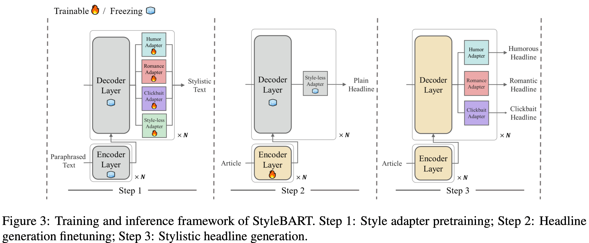

# Core Code Examples for StyleBART

Here, we provide the core code examples for StyleBART, corresponding to Stages 1, 2, and 3. Our code is based on modifications of [run_summarization.py of the Transformers repository](https://github.com/huggingface/transformers/blob/v4.13.0/examples/pytorch/summarization/run_summarization.py):

- **Stage 1:** We train adapters (humor, romance, clickbait, and style-less) on inverse paraphrasing tasks. The main modifications are in **L400-L407** to add an adapter to training.
- **Stage 2:** We incorporate the style-less adapter into the base model and train the encoder on headline generation tasks. The main modifications are in **L400-L413** to insert the pretrained style-less adapter into the base model and only set the encoder to be trainable.
- **Stage 3:** We replace the style-less adapter with a specific style adapter (humor, romance, or clickbait). The model is then ready to generate stylistic headlines. The main modifications are in **L400-L411** to replace the style-less adapter with a specific style adapter.

- **Framework of StyleBART.**

    

